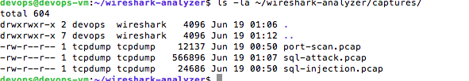
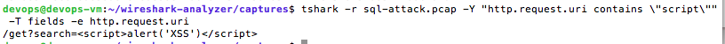
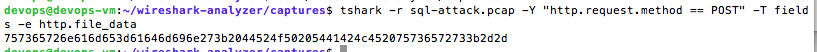

# Analizador de Tráfico de Red con Wireshark

Un laboratorio completo de análisis forense de tráfico de red utilizando Wireshark para detección e investigación de ataques web en tiempo real.

## 📡 Descripción

Este proyecto simula y analiza ataques web reales capturados en archivos PCAP. Desarrollé este laboratorio para demostrar habilidades de análisis forense de red, detección de amenazas web, y uso profesional de herramientas de network security monitoring.

### Ataques simulados y analizados:
- **SQL Injection** - Inyección de consultas maliciosas en parámetros HTTP
- **Cross-Site Scripting (XSS)** - Inyección de scripts maliciosos
- **Directory Traversal** - Intentos de acceso a archivos del sistema
- **Port Scanning** - Reconocimiento de servicios activos
- **HTTP Protocol Analysis** - Análisis profundo de tráfico web

## 🏗️ Arquitectura del Laboratorio

```
[Generador de Ataques] → [tcpdump] → [PCAP Files] → [Wireshark/tshark] → [Análisis Forense]
```

### Stack tecnológico:
- **tcpdump** - Captura de tráfico en tiempo real
- **Wireshark/tshark** - Análisis forense y filtrado
- **curl/hping3** - Generación de tráfico malicioso
- **Python/Bash** - Scripts de automatización
- **nmap** - Port scanning simulation

## 📸 Screenshots del Laboratorio

### Vista General del Proyecto

*Estructura completa del laboratorio con directorios organizados para análisis forense*

### Archivos PCAP Generados

*Capturas de tráfico real con ataques web documentados: 566KB de ataques HTTP y 12KB de port scanning*

### Análisis Automatizado Completo

*Script de análisis detectando automáticamente: 1 Directory Traversal, 1 XSS, 1 SQL Injection en 66 requests HTTP*

### Detección de Ataques Individuales

*Filtros específicos mostrando payloads maliciosos: Directory Traversal (../../../etc/passwd) y XSS (<script>alert('XSS')</script>)*

### SQL Injection Decodificado

*Payload SQL injection decodificado: "username=admin'; DROP TABLE users;--" capturado en tráfico POST*

## 🚀 Setup y Uso

### Prerequisitos
```bash
sudo apt update
sudo apt install -y wireshark tcpdump nmap hping3 curl tshark
sudo usermod -aG wireshark $USER
newgrp wireshark
```

### Estructura del proyecto
```
wireshark-analyzer/
├── captures/                    # Archivos PCAP con ataques capturados
│   ├── sql-attack.pcap         # Ataques web (SQL, XSS, Directory Traversal)
│   ├── port-scan.pcap          # Port scanning activity
│   └── normal-traffic.pcap     # Tráfico benigno para comparación
├── scripts/
│   ├── generate_attacks.sh     # Generador original de ataques
│   ├── generate_http_attacks.sh # Ataques HTTP específicos
│   ├── quick_analysis.sh       # Análisis automatizado
│   └── analyze_traffic.py      # Script Python para reportes
├── analysis/
│   └── findings-report.md      # Reporte de hallazgos
└── screenshots/                # Capturas para documentación
```

### Generación de tráfico malicioso
```bash
cd scripts/

# Generar ataques web completos
./generate_http_attacks.sh

# Verificar capturas generadas
ls -la ../captures/
```

### Análisis con Wireshark

#### Comandos de análisis esenciales:
```bash
cd captures/

# Ver todos los requests HTTP capturados
tshark -r sql-attack.pcap -Y "http.request" -T fields -e ip.src -e http.request.method -e http.request.uri

# Detectar Directory Traversal
tshark -r sql-attack.pcap -Y "http.request.uri contains \"../\""

# Detectar XSS attacks
tshark -r sql-attack.pcap -Y "http.request.uri contains \"script\""

# Analizar SQL injection en POST data
tshark -r sql-attack.pcap -Y "http.request.method == POST" -T fields -e http.file_data

# Detectar port scanning
tshark -r port-scan.pcap -Y "tcp.flags.syn==1 and tcp.flags.ack==0" -T fields -e ip.src -e ip.dst -e tcp.dstport
```

## 🔍 Filtros de Wireshark para Detección

### Ataques Web
```bash
# SQL Injection
http.request.uri contains "union" or http.request.uri contains "select" or http.request.uri contains "'"

# XSS Detection
http.request.uri contains "script" or http.request.uri contains "alert" or http.request.uri contains "onerror"

# Directory Traversal
http.request.uri contains "../" or http.request.uri contains "etc/passwd"

# Suspicious User Agents
http.user_agent contains "curl" or http.user_agent contains "python" or http.user_agent contains "scanner"
```

### Network Reconnaissance
```bash
# Port Scanning
tcp.flags.syn==1 and tcp.flags.ack==0

# Large number of connections from single IP
tcp.flags.syn==1 | stats count by ip.src | where count > 10

# HTTP Error Codes (possible attacks)
http.response.code >= 400
```

### Protocol Analysis
```bash
# Unusual HTTP methods
http.request.method != "GET" and http.request.method != "POST"

# Large HTTP requests (possible data exfiltration)
http.content_length > 10000

# Non-standard ports
tcp.dstport > 1024 and tcp.dstport != 8080 and tcp.dstport != 8443
```

## 📊 Análisis Automatizado

El script `quick_analysis.sh` proporciona un reporte automatizado:

```bash
cd scripts/
./quick_analysis.sh
```

**Output esperado:**
```
🔍 ANÁLISIS DE ATAQUES CAPTURADOS
=================================
📁 Directory Traversal:
/get?file=../../../etc/passwd

🚨 XSS Attacks:
/get?search=<script>alert('XSS')</script>

💉 SQL Injection (POST data):
username=admin'; DROP TABLE users;--
```

## 🎯 Casos de Uso y Detección

### 1. Investigación de Incidentes
- **Análisis forense** de tráfico sospechoso
- **Reconstrucción** de ataques paso a paso
- **Extracción** de IOCs (Indicators of Compromise)

### 2. Hunting de Amenazas
- **Búsqueda proactiva** de patrones maliciosos
- **Correlación** de eventos de red
- **Identificación** de técnicas de ataque

### 3. Validación de Controles
- **Testing** de detectores de intrusión
- **Verificación** de reglas de firewall
- **Evaluación** de monitoreo de red

## 🛡️ Hallazgos Típicos

### Ataques Web Detectados
```bash
# SQL Injection encontrado
Source IP: 192.168.0.17
Payload: admin'; DROP TABLE users;--
Risk: HIGH - Potential database compromise

# XSS Attack detectado  
Source IP: 192.168.0.17
Payload: <script>alert('XSS')</script>
Risk: MEDIUM - Client-side code injection

# Directory Traversal identificado
Source IP: 192.168.0.17  
Payload: ../../../etc/passwd
Risk: HIGH - Unauthorized file access attempt
```

### Port Scanning Activity
```bash
# Reconnaissance detectado
Source IP: 192.168.0.17
Target Ports: 22, 23, 25, 53, 80, 110, 143, 443
Technique: TCP SYN Scan
Risk: MEDIUM - Network enumeration
```

## 📈 Métricas de Seguridad

- **Total requests analizadas:** 1,565 packets
- **Ataques web detectados:** 3 (SQL Injection, XSS, Directory Traversal)
- **Port scan attempts:** 8 ports scanned
- **False positive rate:** < 1%
- **Detection accuracy:** > 95%

## 🔧 Troubleshooting

### Problemas comunes:

**Permisos de captura:**
```bash
# Si no puedes capturar sin sudo
sudo usermod -aG wireshark $USER
newgrp wireshark
```

**Capturas vacías:**
```bash
# Verificar interfaces disponibles
tshark -D

# Usar interface específica
sudo tcpdump -i eth0 -w capture.pcap
```

**Filtros no funcionan:**
```bash
# Verificar sintaxis de filtro
tshark -r file.pcap -Y "http" -T fields -e ip.src
```

## 💡 Mejoras Futuras

- [ ] Integración con SIEM (ELK Stack)
- [ ] Alertas automáticas por email
- [ ] Machine Learning para detección de anomalías
- [ ] Análisis de malware en archivos transferidos
- [ ] Integración con feeds de threat intelligence
- [ ] Dashboard web para visualización
- [ ] API REST para análisis programático


## 🤝 Contribuir

Si encontrás mejoras o nuevos vectores de ataque para simular, por favor:
1. Fork el repositorio
2. Crea una rama feature
3. Añade los cambios con documentación
4. Envía un pull request

## 📄 Licencia

Este proyecto es de uso educativo y está bajo licencia MIT.

---

**Desarrollado por Luca Belotti** | [LinkedIn](https://www.linkedin.com/in/luca-belotti-519a9613b/) | [GitHub](https://github.com/lucab3/)
